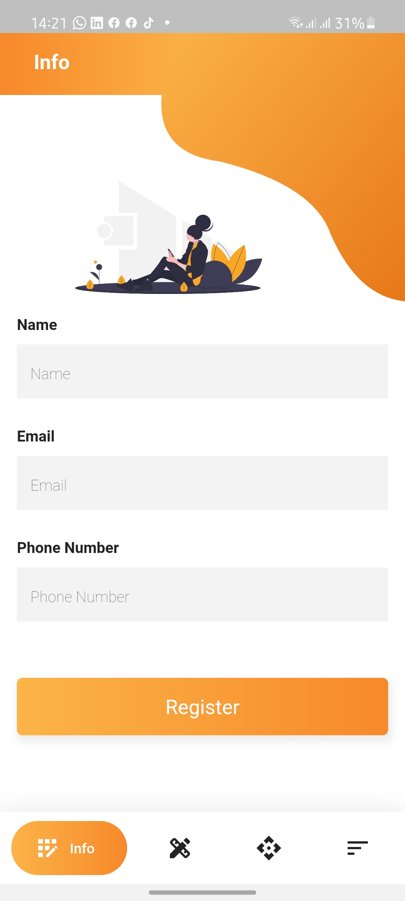
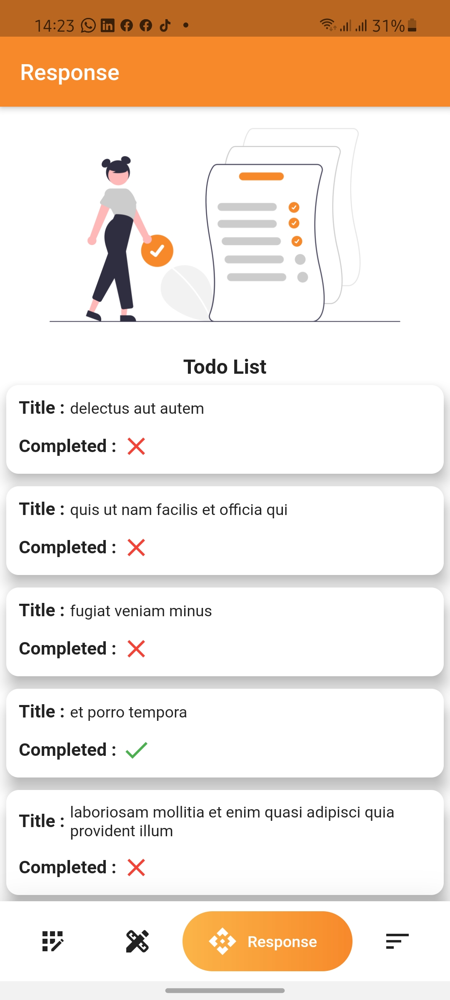
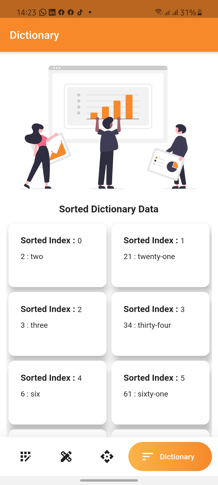

# interintel

This is a flutter app project that implements user registration, Api consumption and Sorting of data in maps

## Screens
### Splash Screen
This is the initial loading screen with text writing animation.

  

### Info Screen
This contains a form that captures user details and redirects to the design screen on user registration

  

### Design Screen
This screen shows the list of users that are registered in cards

  

### response Screen
This show the response data of a to do list API call.

  

### Dictionary Screen
This shows the sorted data of key value pairs dictionary in ascending order.

  

